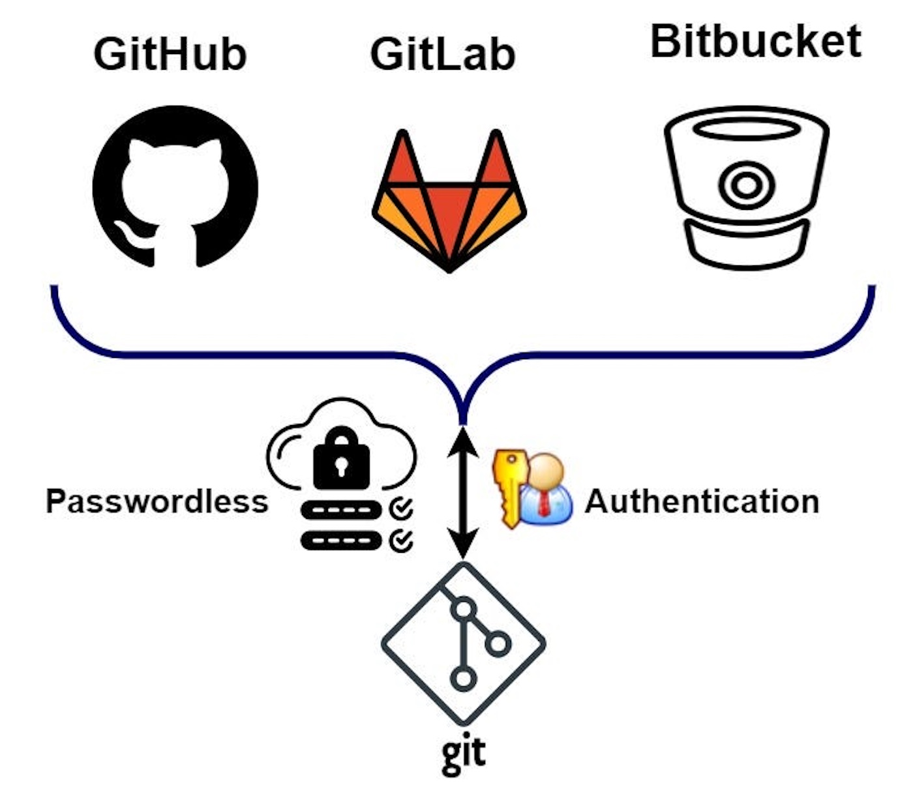
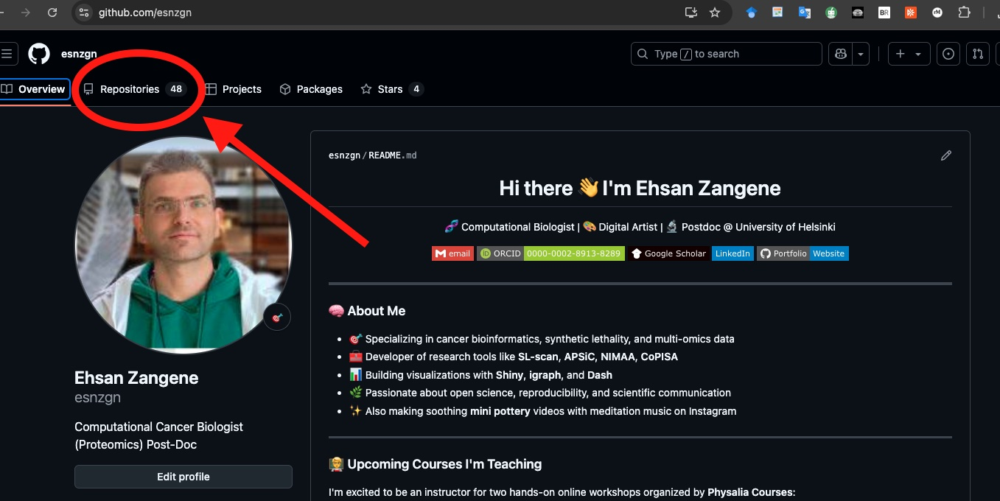
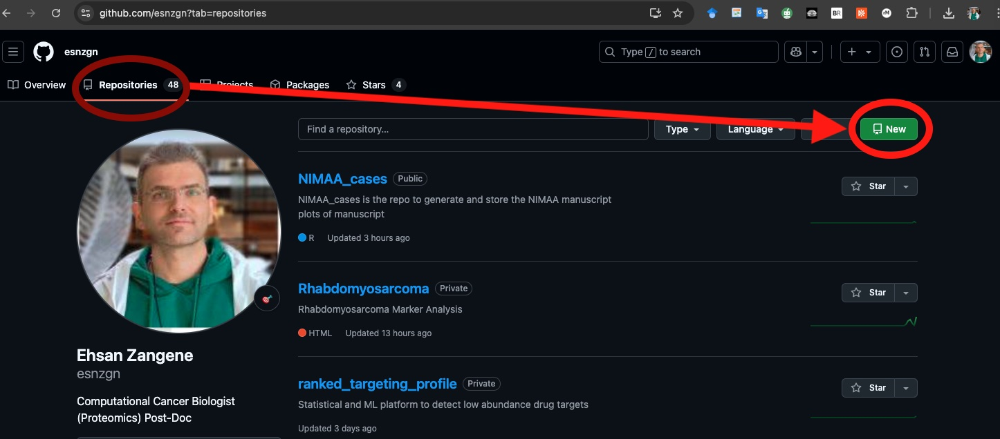
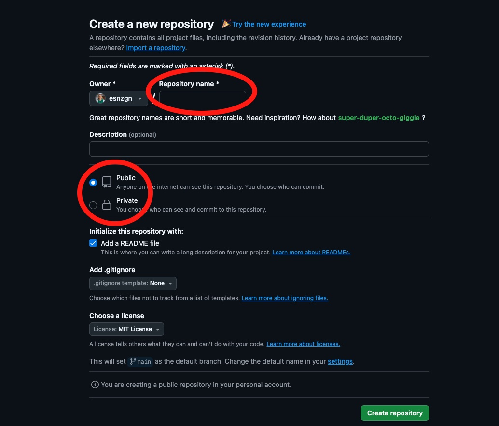

# Git and GitHub Workflow with Authentication and Commands (Mac, Linux, Windows)


## Scenario Overview

Git and GitHub workflow command-line examples.

## 1. Create a GitHub Repository (via Web Interface)



**description:**
> First, go to [github.com](https://github.com), log in, and click the green "New" button to create a repository. Give it a name like `my-first-repo`, optionally add a README file, and choose public or private. Hit "Create repository".

## 2. Authentication Setup

### a. Generate SSH Key (Recommended)

**description:**
>  SSH key

**Mac/Linux/WSL:**
```bash
ssh-keygen -t ed25519 -C "your_email@example.com"
cat ~/.ssh/id_ed25519.pub
```

**Windows - Git Bash:**
```bash
ssh-keygen -t ed25519 -C "your_email@example.com"
cat ~/.ssh/id_ed25519.pub
```

> Copy the SSH key, and go to GitHub > Settings > SSH and GPG keys > New SSH key. Paste it and save.

### b. Test SSH Authentication
```bash
ssh -T git@github.com
```
Expected Output:
> Hi yourusername! You've successfully authenticated.

## 3. Clone the Repository Locally

```bash
git clone git@github.com:yourusername/my-first-repo.git
cd my-first-repo
```

## 4. Make Changes Locally

```bash
echo "# Hello GitHub" > README.md
git status
git add README.md
git commit -m "Add README"
```

**Description:**
> README, checked the status, added it to staging, and committed it with a message.

## 5. Push Changes to GitHub

```bash
git push origin main
```

**Description:**
> The `push` command sends your local changes to the remote GitHub repository.

## 6. Pull Updates from GitHub

```bash
git pull origin main
```

**Description:**
> If your teammates have pushed updates, use `pull` to sync with the latest version.

## 7. Create and Switch Branches

```bash
git checkout -b feature-x
```

Make changes, then:
```bash
git add .
git commit -m "Work on feature X"
git push origin feature-x
```

**Description:**
> Use branches for new features or experiments. When ready, you can open a pull request on GitHub.

## 8. Fork a Repository

> To contribute to someone else's project, click "Fork" on their repository. This makes a copy under your account.

Clone the fork:
```bash
git clone git@github.com:yourusername/their-repo.git
cd their-repo
```

Set upstream to original repo:
```bash
git remote add upstream git@github.com:originaluser/their-repo.git
git fetch upstream
git merge upstream/main
```

## 9. Extra Useful Git Commands

```bash
git log
git diff
git remote -v
git branch
git switch main
```

## Final Notes

- Use GitHub Desktop for a GUI alternative.
- Always `git pull` before you start working.
- Use `.gitignore` to exclude files like `*.log`, `*.Rproj.user`, `__pycache__/`, etc.

## Summary Cheat Sheet

| Task           | Command                                |
|----------------|-----------------------------------------|
| Clone Repo     | `git clone git@github.com:user/repo.git` |
| New Branch     | `git checkout -b my-feature`             |
| Stage File     | `git add filename`                      |
| Commit Changes | `git commit -m "message"`              |
| Push Branch    | `git push origin my-feature`           |
| Pull Main      | `git pull origin main`                 |
| Set Upstream   | `git remote add upstream URL`          |
